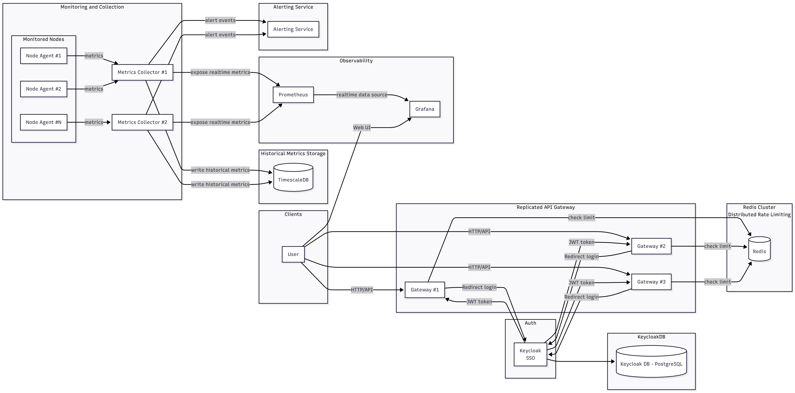

```
==============================================================================
███╗   ██╗ ██████╗ ██████╗ ███████╗███████╗███████╗███╗   ██╗███████╗███████╗
████╗  ██║██╔═══██╗██╔══██╗██╔════╝██╔════╝██╔════╝████╗  ██║██╔════╝██╔════╝
██╔██╗ ██║██║   ██║██║  ██║█████╗  ███████╗█████╗  ██╔██╗ ██║███████╗█████╗
██║╚██╗██║██║   ██║██║  ██║██╔══╝  ╚════██║██╔══╝  ██║╚██╗██║╚════██║██╔══╝
██║ ╚████║╚██████╔╝██████╔╝███████╗███████║███████╗██║ ╚████║███████║███████╗
╚═╝  ╚═══╝ ╚═════╝ ╚═════╝ ╚══════╝╚══════╝╚══════╝╚═╝  ╚═══╝╚══════╝╚══════╝
=============================================================================
                           N O D E   M O N I T O R I N G   P L A T F O R M

```

## NodeSense: Container/VM Monitoring Platform

**NodeSense** is a platform designed for the **continuous monitoring** of **container and VM nodes**. It is based on the core idea that every node in the platform runs an **agent** that collects system metrics (CPU consumption, memory usage, active processes, etc.) and sends this information to a central collection service continuously.

This platform is structured as a **Docker Swarm stack** and provides services for data collection, aggregation, visualization, and alerting.

---

### Key Features

* **Continuous Metric Collection:** An **agent** (Node Agent) runs on each node to collect vital system metrics (CPU, RAM, IO) and sends them to the **Metrics Collector** via REST.
* **High Availability API Gateway:** User access is managed through an **API Gateway** that is replicated so that if one instance fails, the others take over the traffic without interruption.
* **Distributed Rate Limiting:** A distributed **rate-limiting mechanism** is implemented using a **Redis Cluster**.
* **Data Persistence and Analysis:**
    * Collected data is aggregated and saved in a **TimescaleDB** (a time-series database) for analysis.
    * Metrics are exposed toward **Prometheus** and **Grafana** simultaneously.
* **Visualization and Dashboards:** **Grafana** provides dashboards and visualization.
* **Alerting Service:** An **Alerting Service** notifies administrators when critical thresholds are exceeded (e.g., unusually high CPU consumption, unresponsive node).
* **Single Sign-On (SSO):** User authentication and authorization are handled via a **Keycloak** service.

---

### Architecture Overview

The platform is implemented as a **Docker Swarm stack** consisting of the following containers/services:

| Component | Role |
| :--- | :--- |
| **Keycloak** | Authentication and authorization (SSO) |
| **API Gateway** (Replicated) | Routing, token validation, rate-limiting |
| **Redis Cluster** | Storage for distributed rate limiting |
| **Node Agent** | Collecting metrics from nodes |
| **Metrics Collector** (Replicated) | Aggregation and processing of metrics |
| **TimescaleDB** | Storing metrics |
| **Prometheus** | Collecting metrics exposed by the system |
| **Grafana** | Dashboards and visualization |
| **Alerting Service** | Generating notifications based on thresholds |



### Getting Started

To deploy the NodeSense platform, follow these steps:

1. **Clone the Repository:**
    ```bash
    git clone https://github.com/mariapana/NodeSense.git
    cd NodeSense
    ```
2. **Run Setup and Deploy the Stack:**
    ```bash
    ./setup.sh
    ./deploy.sh
    ```
3. **Access the Platform:**
   TODO: Add instructions on how to access the platform (e.g., Grafana URL, Keycloak URL).
4. **Clean Up:**
    ```bash
    ./cleanup.sh
    ```